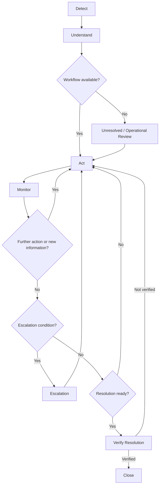
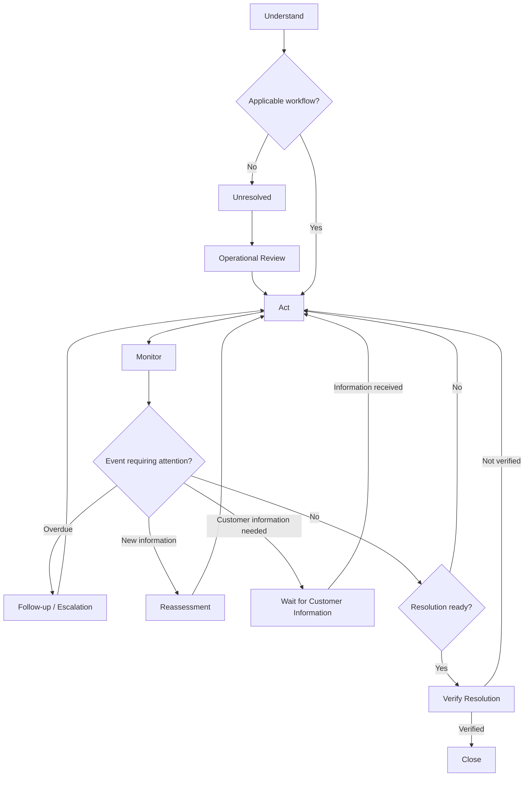
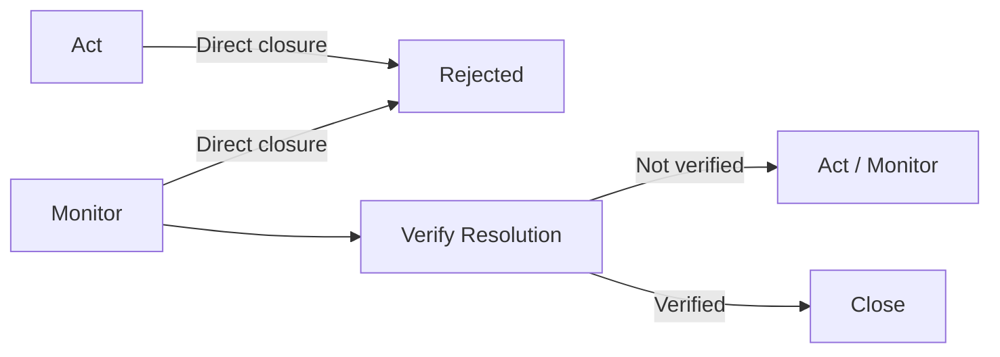

# Model-Based Validation Report — ParcelResolve

**Requirements Engineering**  
**Project:** ParcelResolve  
**Group:** Varun & Thanh  
**Students:** Varun Ganesh Sondur, Pham Thanh  
**Status:** Draft for Assignment 4

---

## 1. Introduction

### 1.1 Purpose

This report documents the Model-Based Validation of the ParcelResolve requirements specification prepared in Assignment 3.

The purpose of the validation is to examine whether the requirements describe a coherent and complete incident-resolution behaviour. Instead of reviewing the requirements only as individual statements, the requirements are evaluated against a behavioural model of the ParcelResolve incident lifecycle.

The validation focuses particularly on:

- valid states and transitions;
- normal and alternative resolution paths;
- exceptional situations;
- conditions for progressing between lifecycle stages;
- conditions for resolution verification and closure;
- possible missing, contradictory, ambiguous, or incomplete behaviour.

The report is a validation artefact that can later be used as the basis for the formal Assignment 4 submission.

### 1.2 Requirements Under Validation

The validation uses the requirements specification from Assignment 3:

- **28 Functional Requirements:** FR-01–FR-28
- **16 Non-Functional Requirements:** NFR-01–NFR-16

Therefore, **44 requirements** are considered in the validation.

The functional requirements cover incident initiation, classification, information management, workflow, actions and responsibility, evidence, monitoring, escalation, customer communication, resolution verification, closure, and operational insights.

The non-functional requirements cover performance, capacity, availability, reliability, security, access control, auditability, usability, maintainability, integration, and observability.

### 1.3 Validation Approach

Model-Based Validation is used to check whether the requirements are consistent with an explicit model of expected system behaviour.

The basic validation process is:

```text
Assignment 3 Requirements
          ↓
Behavioural Model
          ↓
Requirement-to-Model Mapping
          ↓
Model Scenarios and Transitions
          ↓
Validation Questions
          ↓
Findings and Requirement Refinement
```

The model is not intended to describe the implementation architecture. It describes the expected behaviour of an incident as it moves through the ParcelResolve resolution process.

---

# 2. Behavioural Model

## 2.1 Model Objective

The model represents the lifecycle of a parcel incident from detection or reporting until verified resolution and closure.

The main lifecycle established in Assignment 2 is:

**Detect → Understand → Act → Monitor → Verify Resolution → Close**

The model extends this lifecycle with alternative and exceptional paths where required by the Assignment 3 requirements.

## 2.2 Main States

### Detect

The incident enters ParcelResolve after a parcel problem is detected by an integrated operational system or reported by a customer/customer-service channel.

Relevant requirements:

- FR-01 — System-Initiated Incident Creation
- FR-02 — Customer-Initiated Incident Creation
- FR-03 — Incident Standardisation

### Understand

The system gathers and maintains information required to understand the incident.

This includes:

- classification;
- incident information;
- current status;
- history;
- evidence and supporting information.

Relevant requirements:

- FR-04
- FR-05
- FR-06
- FR-07
- FR-08
- FR-14
- FR-15
- FR-16

### Act

The applicable resolution workflow is selected and the required actions are created, assigned, and tracked.

Relevant requirements:

- FR-09
- FR-10
- FR-11
- FR-12
- FR-13

### Monitor

Open incidents and their actions are monitored for deadlines, overdue conditions, status changes, and relevant new information.

Relevant requirements:

- FR-17
- FR-18

### Escalation

An incident may require escalation when configured conditions are met.

Escalation can result in reassignment, priority changes, notification, or a workflow change.

Relevant requirements:

- FR-19
- FR-20

### Verify Resolution

The system verifies whether the applicable resolution conditions have actually been satisfied.

Completing an action is not by itself sufficient to close an incident.

Relevant requirement:

- FR-24

### Close

The incident is closed only after the applicable resolution conditions have been verified.

The resolution outcome and closure information are recorded.

Relevant requirements:

- FR-25
- FR-26

## 2.3 Supporting Behaviour

Some requirements support several lifecycle states rather than representing one individual state.

These include:

- customer communication: FR-21–FR-23;
- operational insights: FR-27–FR-28;
- auditability and quality constraints: NFR-01–NFR-16.

These requirements are therefore validated both against individual states and across the lifecycle.

---

# 3. Main Behavioural Model

The following model represents the main incident-resolution flow.



**Figure 1. ParcelResolve incident-resolution behavioural model.**

```text
                         ┌──────────────────────┐
                         │       DETECT         │
                         │ FR-01, FR-02, FR-03  │
                         └──────────┬───────────┘
                                    │
                                    ▼
                         ┌──────────────────────┐
                         │     UNDERSTAND       │
                         │ FR-04 – FR-08        │
                         │ Evidence FR-14 – 16  │
                         └──────────┬───────────┘
                                    │
                                    ▼
                         ┌──────────────────────┐
                         │ Workflow available?  │
                         └──────┬─────────┬─────┘
                                │ Yes     │ No
                                ▼         ▼
                    ┌────────────────┐   ┌────────────────────┐
                    │      ACT       │   │ Unresolved /       │
                    │ FR-09 – FR-13 │   │ Operational Review  │
                    └───────┬────────┘   └─────────┬──────────┘
                            │                      │
                            │                      ▼
                            │                    ACT
                            │
                            ▼
                    ┌────────────────┐
                    │     MONITOR    │
                    │ FR-17 – FR-18 │
                    └───┬────────┬───┘
                        │        │
             new info /│        │escalation condition
              action    │        ▼
             required   │   ┌───────────────┐
                        │   │  ESCALATION   │
                        │   │ FR-19 – FR-20│
                        │   └───────┬───────┘
                        │           │
                        └───────────┘
                              │
                              ▼
                    ┌────────────────────┐
                    │ Resolution ready?  │
                    └─────────┬──────────┘
                              │ Yes
                              ▼
                    ┌────────────────────┐
                    │ VERIFY RESOLUTION  │
                    │       FR-24        │
                    └─────────┬──────────┘
                              │
                         verified
                              ▼
                    ┌────────────────────┐
                    │       CLOSE       │
                    │   FR-25 – FR-26   │
                    └────────────────────┘
```

---

# 4. Alternative and Exceptional Paths

A model-based validation should not only check the normal path. The model must also represent behaviour when normal assumptions do not hold.



**Figure 3. Alternative and exceptional behavioural paths.**

## 4.1 No Applicable Workflow

FR-09 explicitly defines behaviour when no applicable workflow can be selected.

```text
UNDERSTAND
    ↓
No applicable workflow
    ↓
Unresolved state
    ↓
Notify authorised operational user
    ↓
Operational review
    ↓
ACT
```

Validation purpose:

- checks whether the requirement has a defined fallback;
- prevents an incident from becoming stuck;
- confirms that the system does not silently discard an incident.

## 4.2 Overdue Action

FR-13 and FR-17 require actions and deadlines to be tracked.

```text
ACT
 ↓
Action assigned
 ↓
MONITOR
 ↓
Deadline exceeded
 ↓
Follow-up / escalation
 ↓
ACT or ESCALATION
```

Validation purpose:

- checks that overdue actions have observable consequences;
- checks that monitoring connects to action management and escalation.

## 4.3 New Information During Monitoring

FR-17 requires monitoring for relevant new information.

```text
MONITOR
 ↓
New relevant information
 ↓
Reassessment
 ↓
ACT
 ↓
MONITOR
```

Validation purpose:

- checks whether the model allows the resolution process to react to changed circumstances;
- prevents the lifecycle from being treated as a strictly one-directional sequence.

## 4.4 Customer Information Required

Customer communication may require additional information before the incident can progress.

```text
ACT / MONITOR
      ↓
Additional customer information required
      ↓
Customer communication
      ↓
Wait for information
      ↓
Information received
      ↓
UNDERSTAND / ACT
```

Relevant requirements:

- FR-21 — Customer communication
- FR-22 — Additional information
- FR-23 — Communication history

## 4.5 Escalation

```text
MONITOR
 ↓
Escalation condition
 ↓
ESCALATION
 ↓
Reassignment / priority change / notification / workflow change
 ↓
ACT or MONITOR
```

Relevant requirements:

- FR-19 — Escalation
- FR-20 — Escalation record

## 4.6 Resolution Not Yet Verified

The model must distinguish action completion from actual resolution.

```text
MONITOR
 ↓
Possible resolution
 ↓
VERIFY RESOLUTION
 ↓
Conditions not satisfied
 ↓
ACT / MONITOR
```

This prevents an incident from being closed simply because an operational action was marked complete.

## 4.7 Successful Resolution

```text
MONITOR
 ↓
Resolution conditions satisfied
 ↓
VERIFY RESOLUTION
 ↓
Verification successful
 ↓
CLOSE
 ↓
Closure record
```

Relevant requirements:

- FR-24
- FR-25
- FR-26

---

# 5. Restricted and Invalid Transitions

Model-based validation should also identify behaviour that must **not** be permitted.

The following transitions are restricted:

```text
DETECT ───────────────→ CLOSE        INVALID
UNDERSTAND ───────────→ CLOSE        INVALID
ACT ──────────────────→ CLOSE        INVALID
MONITOR ──────────────→ CLOSE        INVALID
```

A valid closure path must include resolution verification:

```text
MONITOR
   ↓
VERIFY RESOLUTION
   ↓
CLOSE
```

The closure constraint can also be represented as a transition model:



**Figure 2. Valid and invalid closure transitions.**

This model behaviour is supported by FR-24 and FR-25.

The model therefore provides a direct validation question:

> Can an incident be closed without successful resolution verification?

The expected answer is **no**.

---

# 6. Validation Questions

The following questions are applied to the requirements and behavioural model.

| ID | Validation question | Main quality concern |
|---|---|---|
| VQ-01 | Is the behaviour required by the requirement represented in the model? | Completeness |
| VQ-02 | Is the requirement consistent with the model? | Consistency |
| VQ-03 | Does the model allow behaviour that contradicts the requirement? | Consistency |
| VQ-04 | Are alternative outcomes represented? | Completeness |
| VQ-05 | Are exceptional or failure situations represented? | Completeness |
| VQ-06 | Are transition conditions sufficiently clear? | Clarity / ambiguity |
| VQ-07 | Can the requirement be exercised through a reproducible model scenario? | Testability |
| VQ-08 | Can an incident become stuck without a defined next step? | Completeness |
| VQ-09 | Can a required lifecycle state be bypassed? | Consistency |
| VQ-10 | Does the requirement conflict with another requirement? | Consistency |
| VQ-11 | Does the requirement remain within the product scope? | Scope consistency |
| VQ-12 | Does the behaviour support the stakeholder need identified in Assignment 2? | Traceability |
| VQ-13 | Does the requirement impose an unnecessary implementation choice? | Feasibility / design independence |
| VQ-14 | Can the requirement be validated through a concrete model scenario? | Verifiability |

---

# 7. Requirement-to-Model Mapping

## 7.1 Functional Requirements

| Requirement | Model element | Validation focus |
|---|---|---|
| FR-01 | Detect | System-initiated entry |
| FR-02 | Detect | Customer-initiated entry |
| FR-03 | Detect | Common incident structure |
| FR-04 | Understand | Classification |
| FR-05 | Understand | Information retrieval |
| FR-06 | Understand / lifecycle | Required incident information |
| FR-07 | All lifecycle states | Status progression |
| FR-08 | All lifecycle states | Historical trace |
| FR-09 | Understand → Act / Unresolved | Workflow selection and fallback |
| FR-10 | Act | Workflow progression |
| FR-11 | Act | Action creation |
| FR-12 | Act | Responsibility assignment |
| FR-13 | Act / Monitor | Action tracking |
| FR-14 | Understand / Act | Evidence capture |
| FR-15 | Understand / Act | Evidence retrieval |
| FR-16 | Understand / Act | Evidence source/context |
| FR-17 | Monitor | Monitoring conditions |
| FR-18 | Monitor | Follow-up notifications |
| FR-19 | Monitor → Escalation | Escalation transition |
| FR-20 | Escalation | Escalation record |
| FR-21 | Act / Monitor | Customer communication |
| FR-22 | Act / Monitor | Additional customer information |
| FR-23 | All relevant states | Communication history |
| FR-24 | Verify Resolution | Resolution verification |
| FR-25 | Verify Resolution → Close | Closure condition |
| FR-26 | Close | Closure record |
| FR-27 | Supporting view | Open incident overview |
| FR-28 | Supporting view | Operational resolution information |

## 7.2 Non-Functional Requirements

Not all NFRs represent states or transitions. They are therefore validated differently.

| Requirement | Model relationship | Validation approach |
|---|---|---|
| NFR-01 | Applies across lifecycle | Check expected performance of model operations |
| NFR-02 | Applies across lifecycle | Check workload/capacity assumptions |
| NFR-03 | Applies across lifecycle | Check availability assumptions |
| NFR-04 | All states | Check preservation of lifecycle data |
| NFR-05 | All states | Check recovery of incident state |
| NFR-06 | Access to model functions | Authentication before protected actions |
| NFR-07 | Access to model functions | Authorisation for state-changing operations |
| NFR-08 | Interfaces | Check protection of model entry points |
| NFR-09 | All relevant states | Check handling of personal data |
| NFR-10 | All state changes | Auditability of transitions |
| NFR-11 | Operational interaction | Usability of lifecycle operations |
| NFR-12 | All model elements | Consistent terminology |
| NFR-13 | Workflow behaviour | Configurable rules |
| NFR-14 | Integration transitions | Interface support |
| NFR-15 | Integration transitions | Failure handling |
| NFR-16 | All lifecycle states | Monitoring and observability |

---

# 8. Functional Requirement Validation

## 8.1 Incident Initiation — FR-01 to FR-03

### FR-01 — System-Initiated Incident Creation

**Model behaviour:** An integrated operational system provides information satisfying an incident-detection condition, causing the incident to enter the Detect state.

**Validation:** The model represents an external system as an entry point into Detect.

**Result:** Consistent with the model.

**Validation questions:** VQ-01, VQ-06, VQ-07, VQ-12.

### FR-02 — Customer-Initiated Incident Creation

**Model behaviour:** A customer/customer-service channel can create an incident and enter the same lifecycle.

**Validation:** The customer-initiated path reaches the same Detect/Understand flow as a system-initiated incident.

**Result:** Consistent with the model.

### FR-03 — Incident Standardisation

**Model behaviour:** Different entry paths converge into a common incident structure before normal processing.

**Validation:** The model does not maintain separate resolution lifecycles for the two sources.

**Result:** Consistent.

---

# 9. Understanding and Assessment — FR-04 to FR-08

### FR-04 — Incident Classification

The model places classification in Understand before workflow selection.

**Validation result:** Consistent.

The requirement does not claim that classification is always certain. This is important because the classification is based on information available at assessment time.

### FR-05 — Incident Information Retrieval

The model requires relevant information before workflow selection.

**Validation result:** Consistent.

### FR-06 — Incident Information Management

The model requires incident information to remain available throughout the lifecycle.

**Validation result:** Consistent.

### FR-07 — Incident Status Management

The model changes lifecycle state as the incident progresses.

**Validation result:** Consistent.

### FR-08 — Incident History

The model contains multiple state transitions and activities, providing a clear basis for maintaining chronological history.

**Validation result:** Consistent.

---

# 10. Workflow and Action Management — FR-09 to FR-13

### FR-09 — Workflow Selection

The model explicitly represents two paths:

1. applicable workflow found;
2. no applicable workflow found.

The second path enters an unresolved state and requires operational review.

**Validation result:** Consistent and important for completeness.

### FR-10 — Workflow Progression

The model tracks movement through Act and Monitor and allows the process to return to Act when further action is required.

**Validation result:** Consistent.

### FR-11 — Action Creation

Actions are created in the Act state.

**Validation result:** Consistent.

### FR-12 — Action Assignment

The Act state includes assignment to a responsible operational role or user.

**Validation result:** Consistent.

### FR-13 — Action Tracking

The model connects action tracking with Monitor, where deadlines and overdue conditions are evaluated.

**Validation result:** Consistent.

---

# 11. Evidence — FR-14 to FR-16

Evidence is represented primarily within Understand and Act.

The model supports:

- recording/reference of evidence;
- retrieval of evidence;
- source and context information.

**Validation result:** FR-14, FR-15, and FR-16 are consistent with the model.

The model does not require ParcelResolve to become the primary storage system for external evidence.

---

# 12. Monitoring and Escalation — FR-17 to FR-20

### FR-17 — Incident Monitoring

Monitor is explicitly defined as a state in which open incidents and actions are checked for configured conditions.

**Validation result:** Consistent.

### FR-18 — Follow-Up Notification

The model permits monitoring conditions to generate a follow-up notification.

**Validation result:** Consistent.

### FR-19 — Escalation

The model includes Escalation as an alternative path from Monitor.

**Validation result:** Consistent.

### FR-20 — Escalation Record

The model allows escalation information to be recorded before returning to operational handling.

**Validation result:** Consistent.

---

# 13. Customer Communication — FR-21 to FR-23

Customer communication is treated as supporting behaviour that may occur during Act and Monitor.

The model supports:

- communicating incident status;
- requesting additional information;
- recording communication history.

### Validation point

FR-22 introduces a possible waiting condition when additional customer information is required.

A refined model should therefore represent this explicitly rather than assuming that every incident can continuously progress without waiting for external information.

**Current result:** No contradiction identified. The waiting condition should be made explicit in the detailed model.

---

# 14. Resolution Verification and Closure — FR-24 to FR-26

This is a critical part of the model.

### FR-24 — Resolution Verification

The model contains a dedicated Verify Resolution state.

**Validation result:** Consistent.

### FR-25 — Incident Closure

The model allows Close only after successful verification.

**Validation result:** Consistent.

### FR-26 — Closure Record

The Close state records the resolution outcome, closure time, and relevant supporting information.

**Validation result:** Consistent.

### Critical validation rule

The model must reject:

```text
Act → Close
Monitor → Close
```

and require:

```text
Monitor → Verify Resolution → Close
```

This provides a concrete model-based validation of FR-24 and FR-25.

---

# 15. Operational Insights — FR-27 to FR-28

FR-27 and FR-28 are supporting operational capabilities rather than lifecycle transitions.

The model provides the incident states, actions, deadlines, escalation information, and resolution outcomes that these operational views depend on.

**Validation result:** Consistent.

FR-28's filtering dimensions are also compatible with the model because incident type, date-related information, responsible team, and escalation state are represented as incident attributes or lifecycle information.

---

# 16. Non-Functional Requirement Validation

The behavioural model cannot fully validate every quality attribute. NFRs therefore receive one of three validation treatments:

1. **Model-validatable** — the model directly represents the requirement's behaviour.
2. **Partially model-validatable** — the model provides conditions or interactions to validate, but additional testing is needed.
3. **Not fully model-validatable** — the model can expose relevant dependencies, but quantitative or implementation-level validation requires additional techniques.

## 16.1 Performance and Capacity

### NFR-01 — Performance Under Expected Workload

The model identifies operations and transitions that need to occur during incident processing.

**Model contribution:** identifies where response-time expectations apply.

**Additional validation required:** performance testing using defined workload and response-time thresholds.

**Result:** Partially model-validatable.

### NFR-02 — Operational Capacity

The model represents the number and types of operational activities, users, and integration events.

**Additional validation required:** capacity/load testing.

**Result:** Partially model-validatable.

## 16.2 Availability and Reliability

### NFR-03 — Availability

Availability is a system-wide quality property rather than a transition.

**Result:** Not fully model-validatable.

### NFR-04 — Data Integrity

The model can identify information that must survive transitions and failures.

**Result:** Partially model-validatable.

### NFR-05 — Recovery of Incident Data

The model can define the expected incident state after recovery.

**Result:** Partially model-validatable.

## 16.3 Security and Access Control

### NFR-06 — Authentication

The model can require authentication before protected operations.

**Result:** Partially model-validatable.

### NFR-07 — Authorisation and Access Control

The model can represent which roles may perform protected lifecycle operations.

**Result:** Partially model-validatable.

### NFR-08 — Protection Against Excessive Requests

The model identifies external interfaces, but request-rate behaviour requires additional testing.

**Result:** Partially model-validatable.

### NFR-09 — Personal Data Protection

The model identifies states where personal information may be processed.

**Result:** Partially model-validatable.

Full validation requires security/privacy analysis and implementation-level verification.

## 16.4 Auditability

### NFR-10 — Audit Trail

The model contains state changes and activities that should produce auditable records.

**Result:** Partially model-validatable.

## 16.5 Usability and Consistency

### NFR-11 — Operational Usability

The model can identify the actions users must perform, but usability itself requires user evaluation or usability testing.

**Result:** Not fully model-validatable.

### NFR-12 — Terminology Consistency

The model provides a controlled set of states and concepts.

**Result:** Model can support validation of terminology consistency.

## 16.6 Maintainability and Integration

### NFR-13 — Configurable Resolution Rules

The model identifies workflow selection as a rule-dependent transition.

**Result:** Partially model-validatable.

### NFR-14 — Integration Interfaces

The model explicitly includes external systems as entry and information sources.

**Result:** Partially model-validatable.

### NFR-15 — Integration Failure Handling

The model should include an integration-failure path so that an unavailable external system does not leave an incident without a defined state.

**Validation result:** The requirement is relevant to the model, but the failure transition should be represented explicitly in the detailed model.

## 16.7 Observability

### NFR-16 — Operational Observability

The model identifies lifecycle transitions, monitoring conditions, and escalation events that require operational visibility.

**Result:** Partially model-validatable.

---

# 17. Scenario-Based Model Validation

The following scenarios are used to exercise the model.

| Scenario | Expected path | Main requirements |
|---|---|---|
| S-01 Normal system incident | Detect → Understand → Act → Monitor → Verify → Close | FR-01, FR-04, FR-09, FR-24, FR-25 |
| S-02 Customer incident | Customer entry → Detect → Understand → Act → Monitor | FR-02, FR-03 |
| S-03 No workflow | Understand → Unresolved → Operational Review → Act | FR-09 |
| S-04 Overdue action | Act → Monitor → Overdue → Follow-up/Escalation | FR-13, FR-17, FR-18, FR-19 |
| S-05 New information | Monitor → New information → Act → Monitor | FR-17 |
| S-06 Customer information required | Act/Monitor → Request information → Wait → Resume | FR-21, FR-22, FR-23 |
| S-07 Escalation | Monitor → Escalation → Act/Monitor | FR-19, FR-20 |
| S-08 Resolution not verified | Monitor → Verify → Failed → Act/Monitor | FR-24 |
| S-09 Successful resolution | Monitor → Verify → Close | FR-24, FR-25, FR-26 |
| S-10 Invalid closure attempt | Act/Monitor → Close | Must be rejected |
| S-11 Integration failure | External interaction → Failure handling → Recover/Review | FR-05, NFR-14, NFR-15 |
| S-12 Protected operation | Unauthenticated request → Denied → Authentication → Operation | NFR-06, NFR-07 |

---

# 18. Validation Results Summary

The current model provides coverage for all **28 functional requirements**.

| Area | Requirements | Model result |
|---|---:|---|
| Incident initiation | FR-01–FR-03 | Covered |
| Assessment and information | FR-04–FR-08 | Covered |
| Workflow and actions | FR-09–FR-13 | Covered |
| Evidence | FR-14–FR-16 | Covered |
| Monitoring and escalation | FR-17–FR-20 | Covered |
| Customer communication | FR-21–FR-23 | Covered, with waiting behaviour to refine |
| Resolution and closure | FR-24–FR-26 | Covered |
| Operational insights | FR-27–FR-28 | Covered |

All **16 non-functional requirements** are reviewed, but they are not all directly expressible as state transitions.

| NFR validation category | Requirements |
|---|---|
| Directly/partially supported by model | NFR-04, NFR-06, NFR-07, NFR-10, NFR-12, NFR-13, NFR-14, NFR-15, NFR-16 |
| Partially supported; requires additional testing | NFR-01, NFR-02, NFR-05, NFR-08, NFR-09 |
| Requires additional validation technique | NFR-03, NFR-11 |

This distinction is important because Model-Based Validation should not be presented as sufficient evidence for every type of non-functional requirement.

---

# 19. Issues and Refinements Identified

The following points are the main areas identified for refinement during model-based validation.

## 19.1 Explicit Waiting State for Customer Information

**Requirement:** FR-22

The model should explicitly represent a waiting condition when an incident cannot progress until additional customer information is received.

**Reason:** Without an explicit waiting condition, the model may imply that the incident can immediately continue processing.

**Proposed refinement to model:** Add a `Waiting for Customer Information` state.

The current FR-22 requirement can remain unless later analysis shows that the waiting behaviour itself needs to be stated more precisely.

## 19.2 Explicit Closure Restriction

**Requirements:** FR-24 and FR-25

The model demonstrates that closure must not be reachable directly from Act or Monitor.

**Decision:** Preserve the existing requirements and make the restriction explicit in the behavioural model.

## 19.3 Explicit Integration Failure Path

**Requirement:** NFR-15

The model should represent what happens when an integrated system is unavailable or returns an unusable response.

**Decision:** Add an integration-failure path to the detailed model.

The exact recovery mechanism should remain outside the requirements model unless specified later.

## 19.4 Quantitative NFR Thresholds

**Requirements:** NFR-01, NFR-02, NFR-03, NFR-05, NFR-08

The current requirements intentionally avoid arbitrary numerical values because Assignment 2 did not establish sufficient operational baselines.

**Decision:** Do not invent thresholds during model validation.

These values should be established later using operational data, stakeholder agreement, or system constraints.

---

# 20. Requirements That Are Not Fully Validated by the Behavioural Model

Model-Based Validation is useful but has limits.

The following aspects require additional validation techniques:

- exact performance measurements;
- capacity limits;
- availability percentages;
- recovery time and recovery point targets;
- usability with real operational users;
- security penetration testing;
- privacy compliance verification;
- actual integration reliability;
- implementation-level observability.

Therefore, a requirement being compatible with the behavioural model does **not** mean that the implemented system has been proven to satisfy it.

The model validates the coherence and expected behaviour represented by the requirement.

---

# 21. Human Judgment and Model Contribution

The behavioural model provides a systematic way to identify:

- missing transitions;
- unreachable states;
- invalid transitions;
- missing alternative paths;
- missing exception paths;
- lifecycle inconsistencies;
- requirements that cannot be exercised through a clear scenario.

However, the model itself does not decide whether a requirement is appropriate for the organisation.

Human judgment is still required to determine:

- whether the model represents the intended business process;
- whether a requirement is sufficiently precise;
- whether a proposed refinement changes the intended scope;
- whether a quality target is realistic;
- whether stakeholder needs are correctly represented.

The model therefore acts as a validation aid rather than replacing requirements engineering judgment.

---

# 22. Limitations of the Validation

This draft validation has several limitations.

1. The behavioural model is derived from the requirements and product lifecycle, so an incorrect assumption in the source requirements can also appear in the model.
2. Quantitative non-functional requirements cannot be proven through a state-transition model alone.
3. Some operational details, such as exact escalation rules and integration failure recovery, are not yet specified.
4. The model does not represent the internal software architecture or implementation technology.
5. Stakeholder acceptance and usability require validation with real users.
6. The current model is a requirements-level behavioural model, not an executable model-based testing environment.

---

# 23. Conclusion

The Model-Based Validation shows that the ParcelResolve requirements describe a coherent incident-resolution lifecycle from detection through verified closure.

The main lifecycle is represented as:

**Detect → Understand → Act → Monitor → Verify Resolution → Close**

The model also represents important alternative and exceptional paths, including:

- system-initiated and customer-initiated incidents;
- absence of an applicable workflow;
- overdue actions;
- escalation;
- new information;
- customer information requests;
- unsuccessful resolution verification;
- integration and access-control conditions.

No major contradiction between the functional requirements and the current lifecycle model has been identified in this draft.

The main refinements identified are the explicit representation of waiting for customer information, integration failure handling, and the restriction that closure must follow successful resolution verification.

The validation also demonstrates that Model-Based Validation is more directly applicable to behavioural functional requirements than to quantitative or experiential non-functional requirements. Additional validation techniques will therefore be required for performance, availability, usability, security, privacy, and other implementation-level quality concerns.

---

# Appendix A — Compact Validation Checklist

For each requirement, the following questions should be considered:

- Is the required behaviour represented?
- Is the behaviour reachable?
- Is the transition valid?
- Are all relevant alternative paths represented?
- Are exception paths represented?
- Can the incident become stuck?
- Can a required lifecycle state be bypassed?
- Does the requirement conflict with another requirement?
- Is the behaviour sufficiently clear?
- Can the behaviour be exercised in a reproducible scenario?
- Does the requirement remain within the product scope?
- Does the requirement support a stakeholder need?
- Does the requirement avoid unnecessary implementation constraints?
- Does the model expose any missing requirement?

---

# Appendix B — Validation Coverage

**Functional requirements reviewed:** 28/28  
**Non-functional requirements reviewed:** 16/16  
**Total requirements reviewed:** 44/44

**Primary model:** ParcelResolve Incident Resolution Lifecycle

**Core lifecycle:**

```text
Detect
  ↓
Understand
  ↓
Act
  ↓
Monitor
  ↓
Verify Resolution
  ↓
Close
```

**Key restricted transition:**

```text
Act / Monitor
     ↓
   Close       ✗
```

**Required closure path:**

```text
Monitor
   ↓
Verify Resolution
   ↓
Close           ✓
```

---

# Assignment 4 — Requirements Review Process and Results

This section presents the Assignment 4 submission structure separately from the detailed Model-Based Validation report above.

## A. Requirements Review Process

### A.1 Self Analysis

#### Technique

We selected **Model-Based Validation (MBV)** as the requirements review technique.

The technique was selected because ParcelResolve has a defined incident-resolution lifecycle and many of its requirements describe behavioural changes, transitions, conditions, and alternative paths. A behavioural model therefore provides a way to review the requirements as a connected process rather than as isolated statements.

#### Inputs and Scope

The main input was the Requirements Specification prepared in Assignment 3.

The review covers:

- FR-01–FR-28
- NFR-01–NFR-16
- 44 requirements in total

The product vision, scope, stakeholder analysis, and lifecycle from Assignment 2 were used as context.

#### Behavioural Model

The main lifecycle used for validation is:

**Detect → Understand → Act → Monitor → Verify Resolution → Close**

The model also includes alternative and exceptional behaviour:

- no applicable workflow;
- unresolved state and operational review;
- overdue actions;
- escalation;
- new information;
- waiting for customer information;
- unsuccessful resolution verification;
- integration failure;
- authentication and authorisation conditions.

The model is a requirements-level behavioural model. It is not an implementation or software architecture model.

#### Validation Process

The requirements were mapped to states, transitions, conditions, or supporting behaviour in the model.

The validation then considered normal, alternative, exceptional, and invalid scenarios.

The main validation questions were:

1. Is the required behaviour represented in the model?
2. Is the requirement consistent with the model?
3. Does the model allow behaviour that contradicts the requirement?
4. Are alternative outcomes represented?
5. Are exceptional situations represented?
6. Are transition conditions sufficiently clear?
7. Can the requirement be exercised through a reproducible scenario?
8. Can an incident become stuck without a defined next step?
9. Can a required lifecycle state be bypassed?
10. Does the requirement conflict with another requirement?
11. Does the requirement remain within product scope?
12. Does the behaviour support the stakeholder needs identified in Assignment 2?
13. Does the requirement introduce an unnecessary implementation constraint?
14. Can the requirement be validated through a concrete model scenario?

#### Scenarios Used

The main scenarios considered were:

- normal system-initiated incident;
- customer-initiated incident;
- no applicable workflow;
- overdue action;
- new information during monitoring;
- additional customer information required;
- escalation;
- resolution not yet verified;
- successful resolution;
- invalid closure attempt;
- integration failure;
- authentication/authorisation failure.

#### Treatment of NFRs

The behavioural model does not fully validate every type of NFR.

Some NFRs can be related to model behaviour, while others require additional techniques such as performance testing, capacity testing, usability evaluation, security testing, privacy analysis, or availability testing.

The model was therefore used to identify where NFRs apply without treating model compatibility as proof that an NFR is satisfied by an implementation.

#### Evidence and Reproducibility

The validation can be reproduced using:

- the Assignment 3 requirements;
- the behavioural model;
- the requirement-to-model mapping;
- the validation questions;
- the validation scenarios;
- the documented findings and decisions.

No automated model-checking tool was used to automatically prove the requirements.

---

### A.2 Review with Claude

**Status: To be completed after independent Claude review.**

Claude will be used as a review aid to examine the Model-Based Validation process and identify:

- missing validation steps;
- missing model states or transitions;
- overlooked alternative or exceptional paths;
- unclear validation questions;
- weaknesses in traceability;
- limitations in the treatment of NFRs;
- possible improvements to reproducibility.

Claude's suggestions will be reviewed by the group before being accepted.

Only suggestions supported by the requirements and project documentation will be incorporated.

---

## B. Validation Results

### B.1 Self Analysis

#### Requirements Reviewed

A total of **44 requirements** were reviewed:

- 28 functional requirements: FR-01–FR-28
- 16 non-functional requirements: NFR-01–NFR-16

#### Functional Requirement Results

| Requirement area | Requirements | Self-analysis result |
|---|---:|---|
| Incident initiation | FR-01–FR-03 | Covered |
| Assessment and information | FR-04–FR-08 | Covered |
| Workflow and actions | FR-09–FR-13 | Covered |
| Evidence | FR-14–FR-16 | Covered |
| Monitoring and escalation | FR-17–FR-20 | Covered |
| Customer communication | FR-21–FR-23 | Covered, with waiting behaviour to refine |
| Resolution and closure | FR-24–FR-26 | Covered |
| Operational insights | FR-27–FR-28 | Covered |

#### Main Findings

The self-analysis did not identify a major contradiction between the functional requirements and the main incident-resolution lifecycle.

The following points were identified for refinement:

**FR-22 — Customer information waiting**

The model should explicitly represent a waiting condition when additional customer information is required.

```text
Act / Monitor
     ↓
Customer information required
     ↓
Waiting for Customer Information
     ↓
Information received
     ↓
Understand / Act
```

**FR-24 / FR-25 — Resolution verification before closure**

The model should prevent an incident from being closed directly from Act or Monitor.

```text
Monitor
   ↓
Verify Resolution
   ↓
   ├── Not verified → Act / Monitor
   │
   └── Verified → Close
```

Therefore:

```text
Act → Close       INVALID
Monitor → Close   INVALID
```

**NFR-15 — Integration failure**

The model should explicitly represent what happens when an external integration is unavailable or returns an unusable response.

**NFR-01, NFR-02, NFR-03, NFR-05 and NFR-08**

The current requirements do not contain justified numerical thresholds. These should not be invented during validation and should be defined later using appropriate operational evidence and stakeholder agreement.

**NFR-11 — Usability**

Usability cannot be fully validated through the behavioural model. Additional user-oriented validation is required.

#### NFR Results

| Validation category | Requirements | Self-analysis result |
|---|---|---|
| Directly or partially supported by the model | NFR-04, NFR-06, NFR-07, NFR-10, NFR-12, NFR-13, NFR-14, NFR-15, NFR-16 | Model provides useful validation |
| Partially supported and requiring additional testing | NFR-01, NFR-02, NFR-05, NFR-08, NFR-09 | Additional validation required |
| Not fully model-validatable | NFR-03, NFR-11 | Additional validation technique required |

#### Overall Self-Analysis Result

The behavioural model represents the main ParcelResolve lifecycle and provides coverage for all 28 functional requirements.

The main refinement areas are:

1. waiting for customer information;
2. preventing closure before successful resolution verification;
3. integration failure handling;
4. later definition of quantitative NFR targets;
5. additional validation techniques for NFRs that cannot be fully evaluated through the behavioural model.

---

### B.2 Review with Claude

**Status: To be completed after independent Claude review.**

Claude will review the self-analysis results and identify whether:

- any requirement was incorrectly classified as covered;
- any important scenario is missing;
- any finding should be classified differently;
- any requirement needs refinement;
- any NFR has been treated too strongly or too weakly;
- any conclusion is unsupported by the model;
- additional traceability or validation evidence should be included.

Claude's output will be treated as a proposal rather than as an automatic decision.

The group will compare Claude's observations with the actual requirements and behavioural model before deciding which proposals to accept.

---

## C. Review Decision Record

After the Claude review, accepted suggestions should be recorded here rather than silently merged into the self-analysis.

| ID | Source | Proposal | Decision | Reason |
|---|---|---|---|---|
| C-01 | Self Analysis | — | — | — |
| C-02 | Claude Review | — | — | — |
| C-03 | Claude Review | — | — | — |

This makes it possible to distinguish the group's own analysis from AI-supported suggestions and shows that final decisions were made by the group.
